# Out of the Box Service Monitoring

This guide provides setup requirements and steps to demonstrate how to use the Azure Preview Portal’s ([http://portal.azure.com](http://portal.azure.com)) out of the box service monitoring and diagnostics features.  Alert functionality is also showcased with a new alert being created by the demonstrator.

## Contents
* [Pre-Requisites](#pre)	
* [Setup](#setup)	
* [Demo Steps](#demosteps)	
* [Clean Up](#cleanup)	

##  Pre-Requisites
* An Azure subscription

##  Setup 
*Estimated time: 15 minutes*
1.	Open a web browser and navigate to http://portal.azure.com
2.	Sign in with your Microsoft Azure Subscription
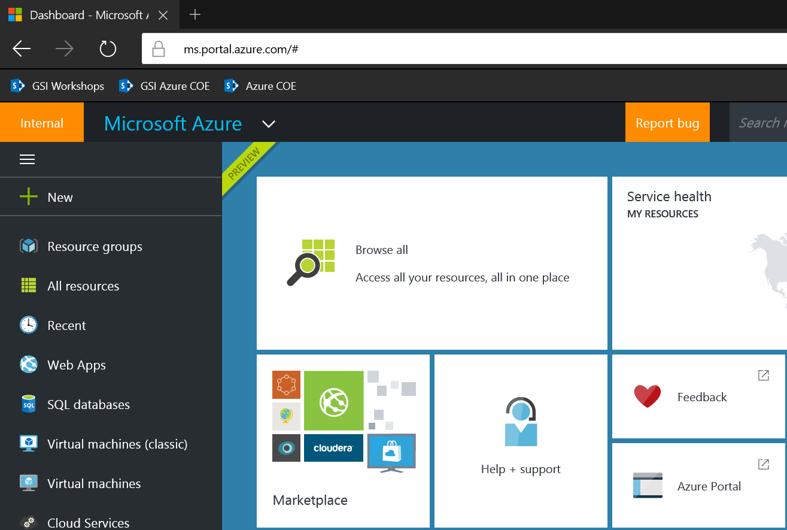

3.	Click the "+" sign on the left navigation menu 
4.	Select "Compute" 
5.	Select Windows Server 2012 R2 Datacenter
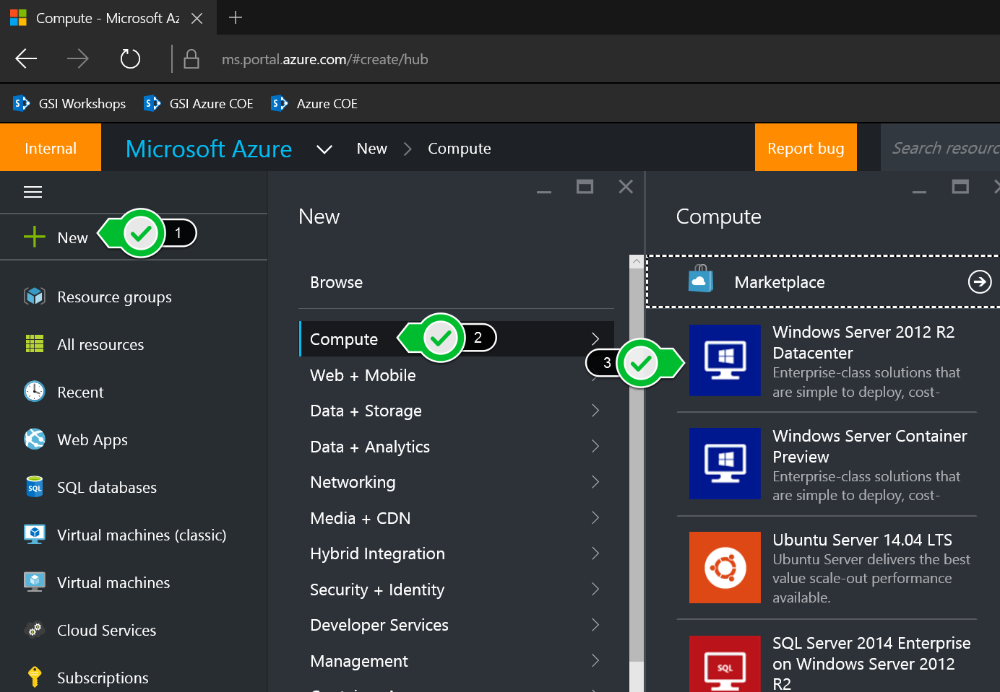

6.	For the "Select a deployment model" dropdown, select "Resource Manager" and click Create
7.	Fill out the details for the new VM. A small A1 instance is fine
8.	Click OK to setup the VM. This process can take 10 minutes or longer
9.	When the provisioning process is finished, proceed to the Demo Steps
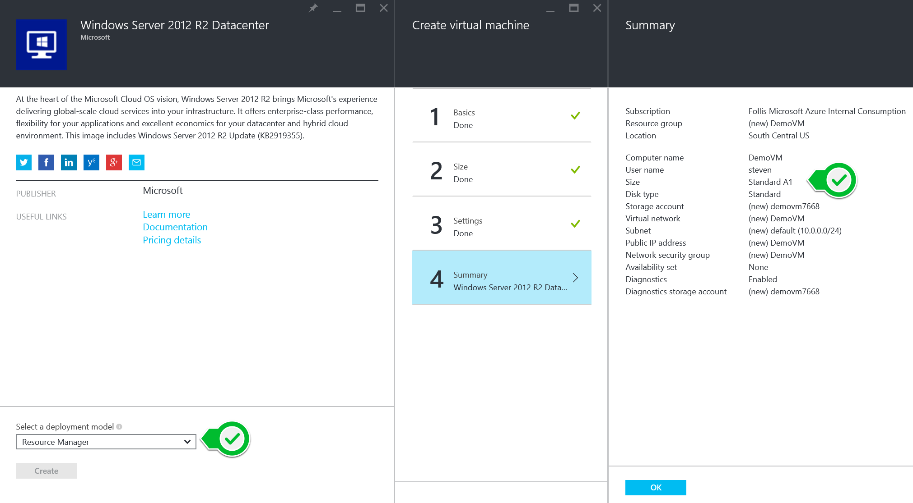

Stop here.  This is where the demo steps will continue from.

##  Demo Steps
*Estimated time: 10 minutes*

1.	In the Azure Management Portal, navigate to the DemoVM that was created in the demo setup instructions
2.	Discuss how the VM’s blade comes pre-configured with a variety of monitoring information including CPU Percentage, Memory Usage, Disk Read, and Disk Write
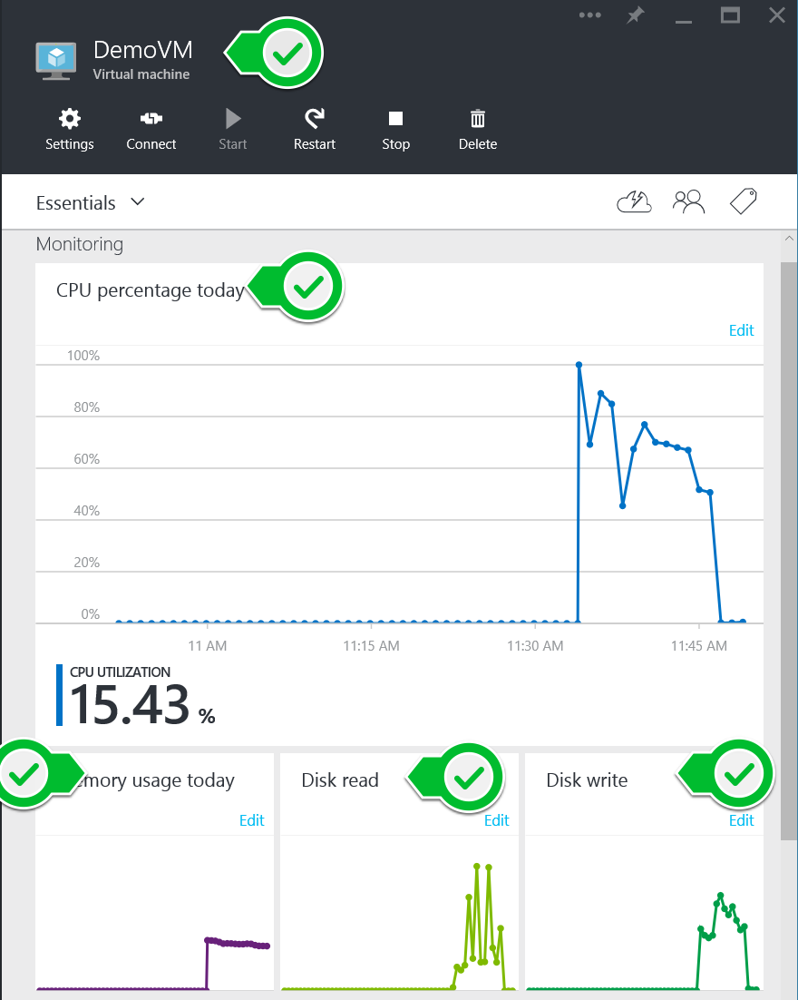

3.	Click the box for "Memory Usage Today" to launch the metric’s blade
4.	Click "Diagnostic settings" from the blade’s toolbar and show how additional metrics such as IIS logs can be pulled from the VM
5.	Add a checkbox to "`IIS Logs`" and save
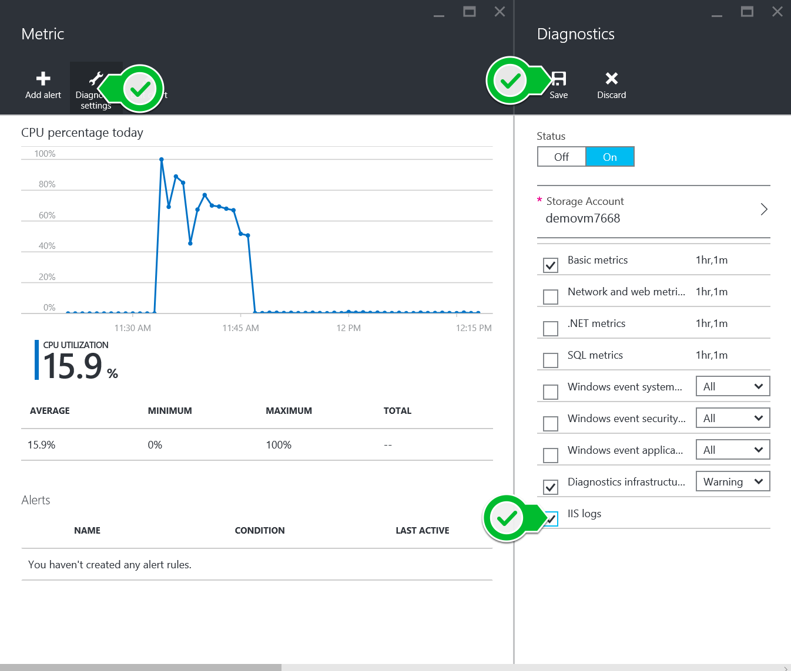

6.	Back on the Metric blade, click "Add Alert"
7.	On the "Add an alert rule" blade, add a rule named "Heavy Memory Utilization" using the "Memory percentage" metric of greater than 80% and the "email service and co-administrators" box checked
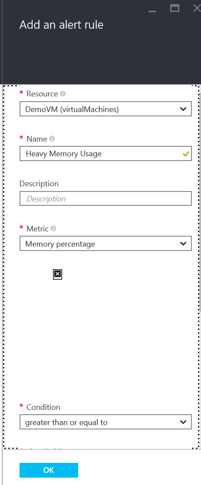

8.	Back on the VM’s home blade, point out the Events graph under the “Operations” heading
9.	Click the graph to launch the Events blade
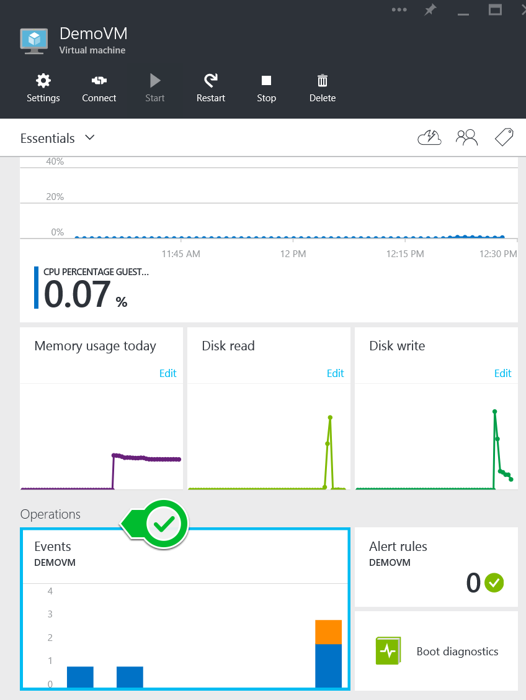

10.	On the Events blade, click the “Filter” button and discuss the ability to filter the data directly from the web portal
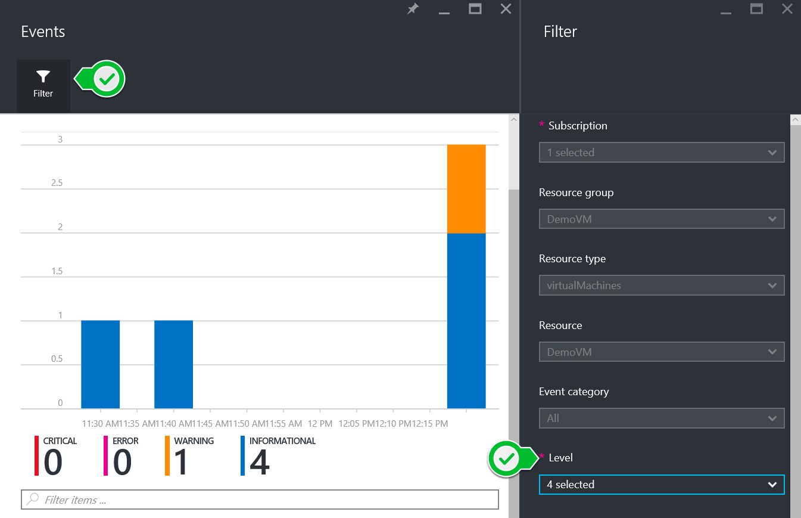

11.	On the Events blade, click a row in the “Events” table and discuss the log data that is being captured. 
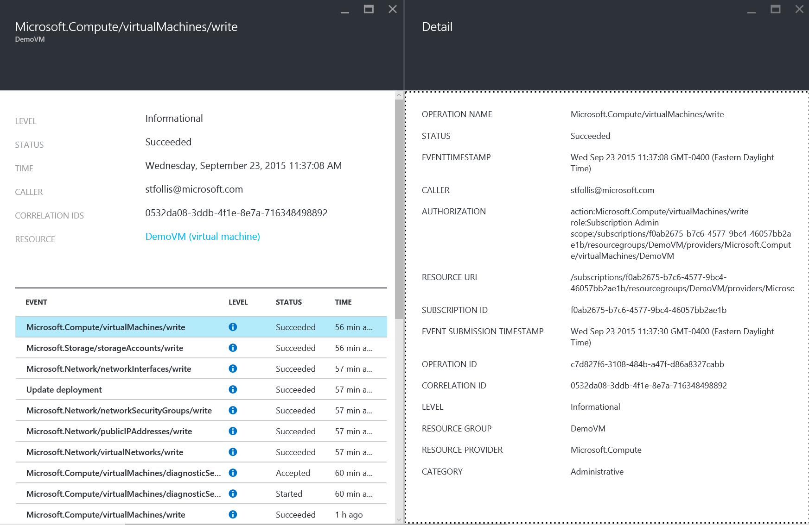

12.	Discuss that while these event logs correspond to an individual resource such as a VM or Web App, we can also aggregate groups of resources for broader monitoring
13.	Navigate back to the Resource Group’s blade and point out the “Events” tile. Note that it includes events for all resources within that resource group
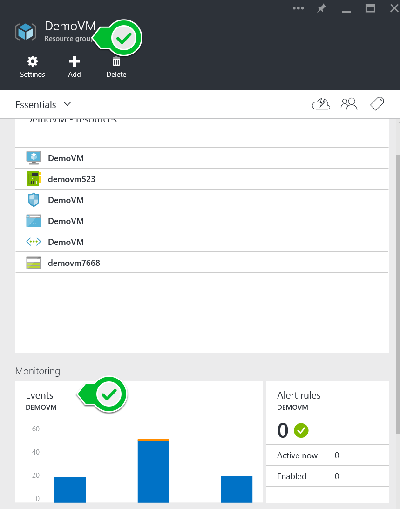

14.	Discuss that we can also get event data across an entire Azure Subscription, giving a true “top-down” look at every single resource we have provisioned across multiple solutions
15.	On the left hand navigation, click “Browse” then select “Audit Logs”
16.	Speak to the consistent Filter functionality and grouping of event data into Critical/Error/Warning/Informational
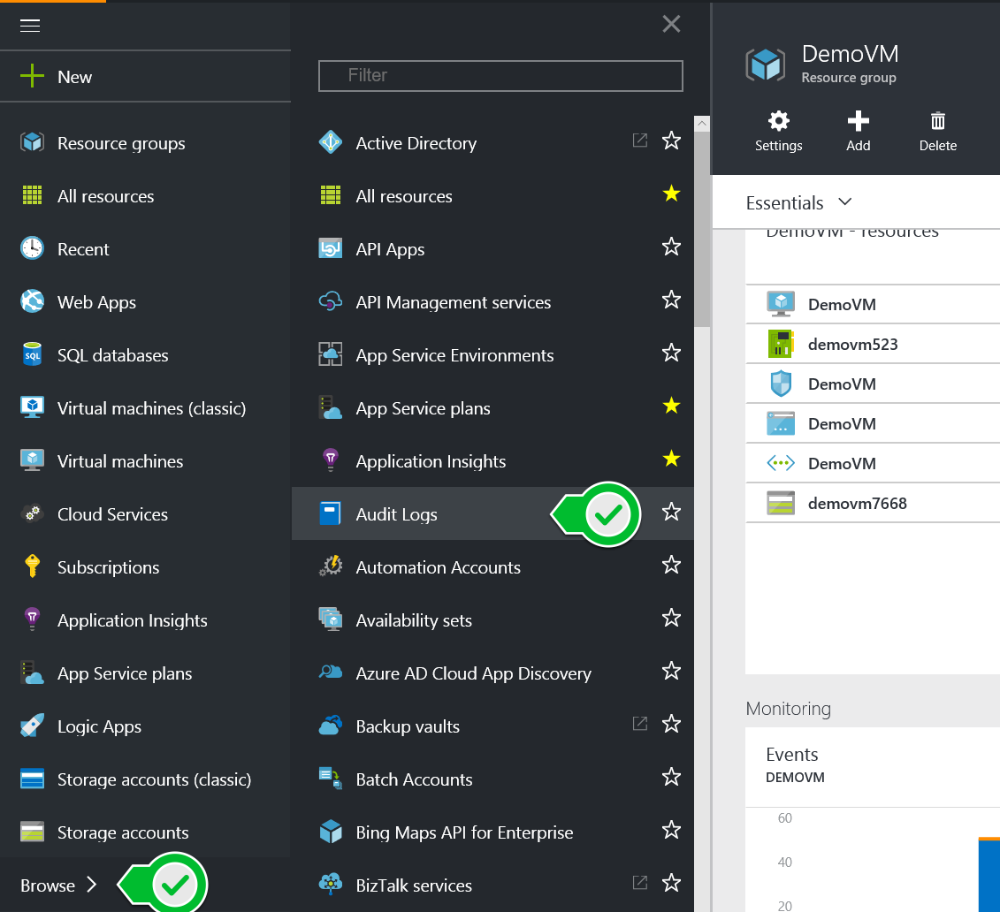

17.	Summarize how by default Azure gives numerous monitoring features right in the out-of-the-box management portal, how 3rd party solutions may not be necessary, and that all this same information is accessible via an API layer

##  Clean Up
To clean up after this demo simply delete the resource group containing the sample virtual machine.