# Monitoring with Operational Insights

This guide provides setup requirements and steps to demonstrate how to use the Azure Operational Insights for monitoring and diagnostics scenarios.  The demo is a lap around the different area of the service, giving audience members deeper familiarity with the features and functionality of Ops Insights.

## Contents
* [Pre-Requisites](#pre)	
* [Setup](#setup)	
* [Demo Steps](#demosteps)	
* [Clean Up](#cleanup)	

##  Pre-Requisites
* An Azure subscription

##  Setup 
*Estimated time: 15 minutes*

1.	First we need to setup an instance of Operational Insights. Open a web browser and navigate to http://manage.windowsazure.com
2.	Sign in with your Microsoft Azure Subscription
3.	Click the “+” sign on the bottom navigation menu 
4.	Select “App Services”, then “Operational Insights”, then “Quick Create”
5.	Fill in an account name, workspace name, tier (Free is OK), and location
6.	Click “Create Workspace” to provision the new Operational Insights Workspace
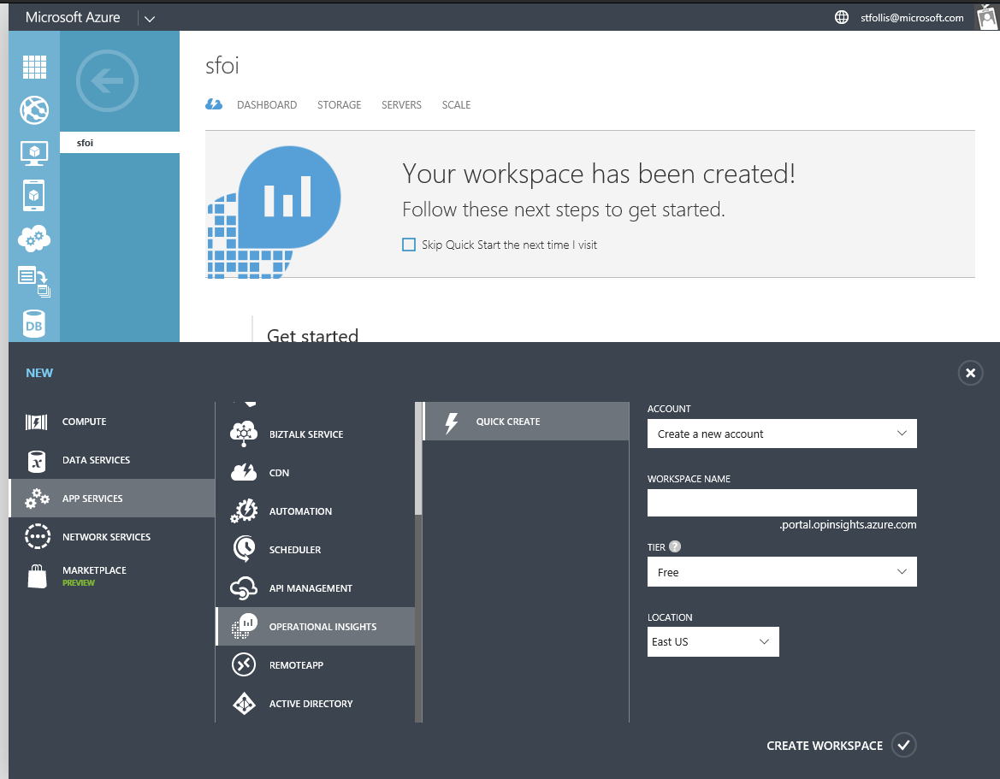

7.	Now that we have an instance of Operational Insights, some data is necessary to connect to it.  We’ll use a SharePoint Farm. Complete the steps at https://azure.microsoft.com/en-us/documentation/articles/virtual-machines-sharepoint-farm-azure-preview/ with the High Availability options turned on
Note: A highly available SP Farm will eat through subscription fees. Feel free to substitute a non-HA SP Farm, or another multi-tier application to make the demo cheaper to run.  The important part is having at least 3 virtual machines. This step can take 12+ hours to finish provisioning, so please allow sufficient time for creation of all resources
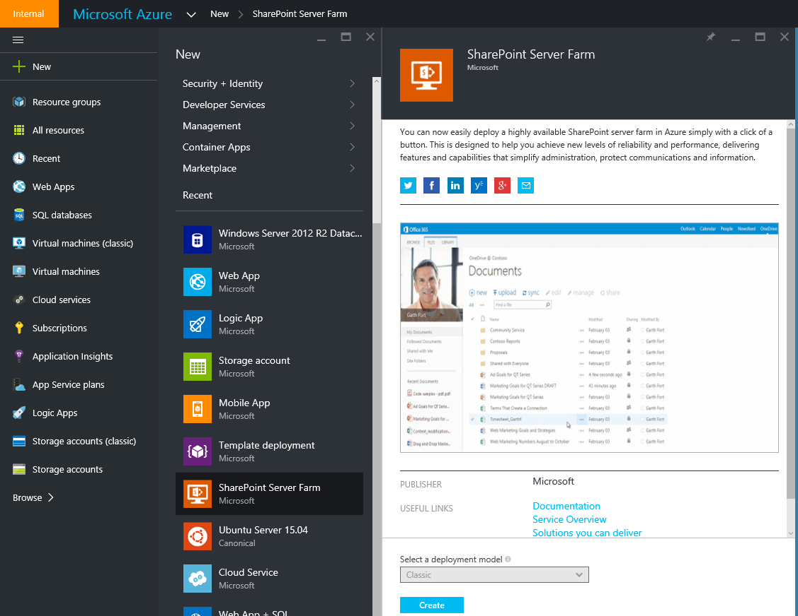

8.	We now need to link the newly created virtual machines to Operational Insights.  Return to the Operational Insights Dashboard
9.	Under the heading “Get Started”, click “Visit your Operational Insights account” to launch the dashboard
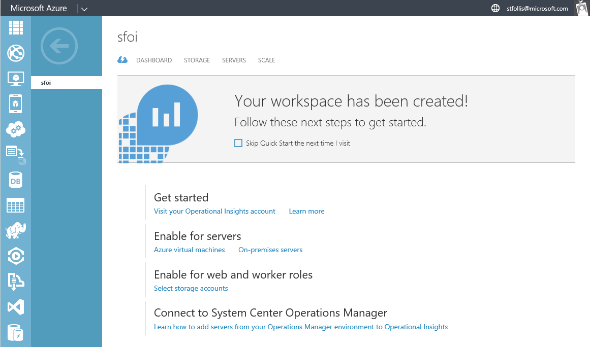

10.	From the Microsoft Operations Management Suite dashboard click the “Settings” tile
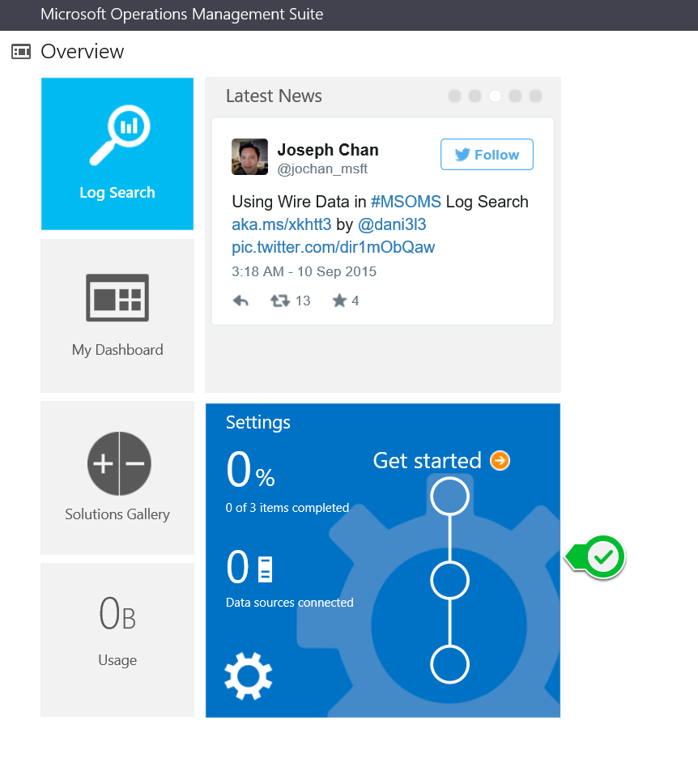

11.	The dashboard will pre-select several solutions for you. Click the “Add selected solutions” button to accept
12.	Next click the link at the top for “Connected Sources”. 
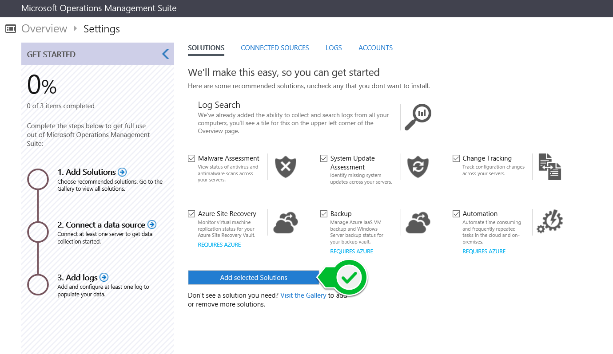

13.	We can add VMs to monitor in a variety of ways, but since we setup our SP farm in Azure we don’t have to mess with downloading agents.  Open up a new tab and navigate to http://manage.windowsazure.com, then click on the left hand link for Operational Insights, and select your Ops Insights instance.  
14.	From the dashboard of your instance, click the top nav link for “Servers”
15.	For each server, click its name and the “Enable Op Insights” button on the bottom nav. Please allow 10+ minutes to install, as it can take time to enroll each VM into Ops Insights.  If the Status column says “Error” wait longer and it should resolve itself
16.	When finished, switch back to the Microsoft Operations Management Suite tab in your browser
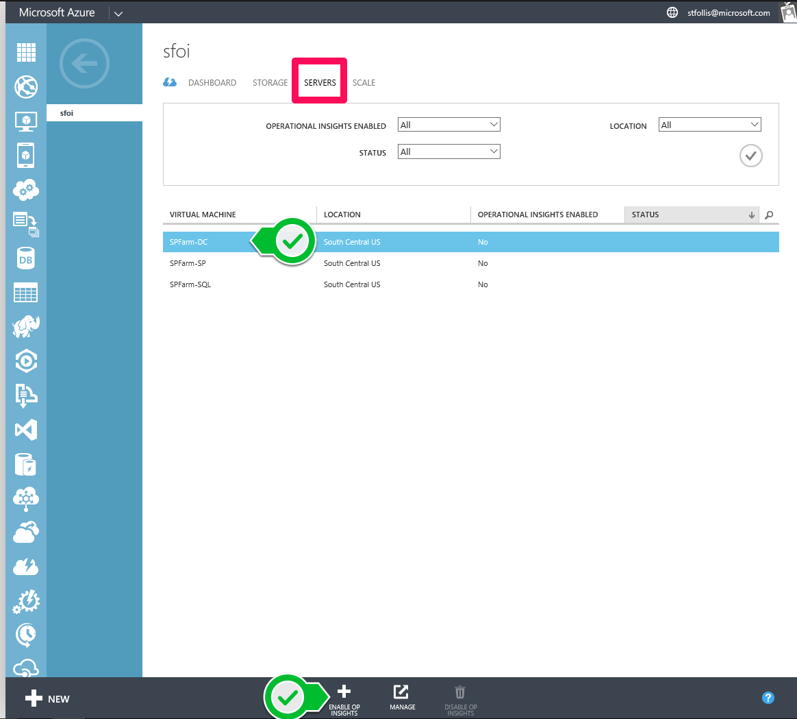

17.	Continuing on the MOMS dashboard from Settings -> Connected Sources, verify that “3 Server Connected” and continue by clicking “Logs” from the top nav
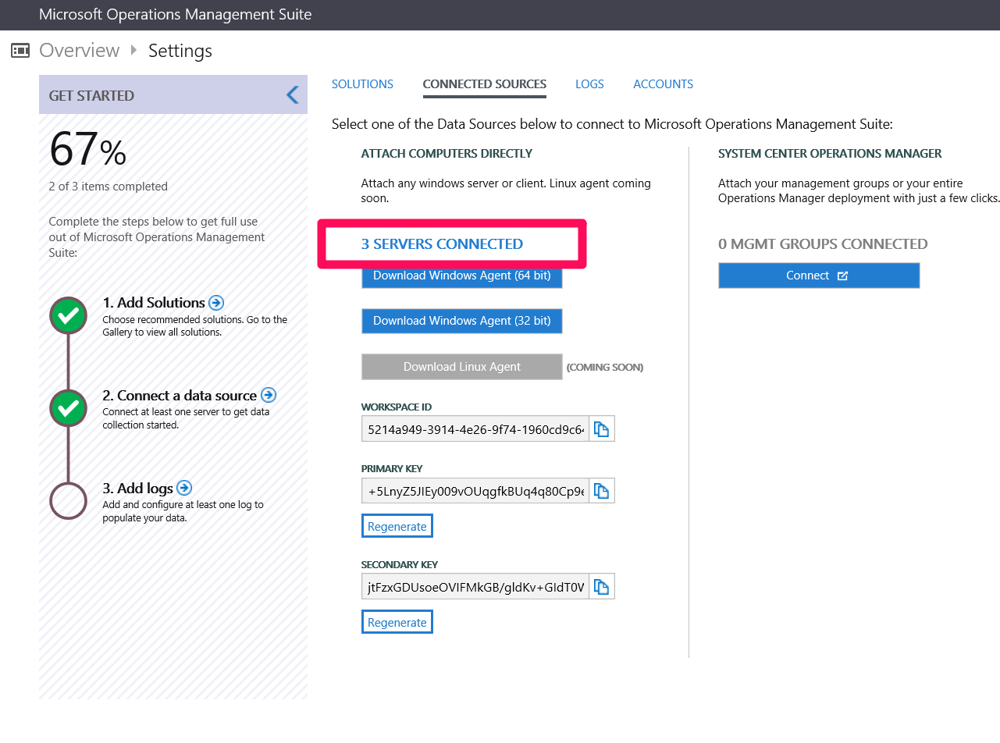

18.	Click to enable “Collect W3C format IIS log files”
19.	Add a couple of additional log files in the Event Logs search box, such as “Application” and “System”.  Toggle the checkboxes for Error/Warning/Information
20.	Under Performance Counters, the service has preselected some performance counters. Click the blue “add” button to accept
21.	Click on the title “Microsoft Operations Management Suite” in the top left to return to the home dashboard, saving changes if prompted
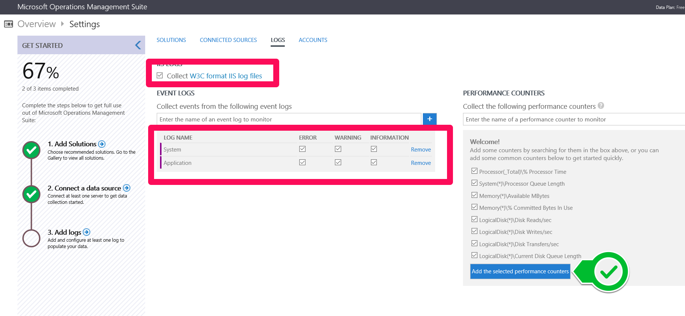

22.	Click “Solutions Gallery” on the left nav 
23.	Add “AD Assessment”, “SQL Assessment”, and “Security and Audit” by clicking on their respective tile, then clicking the “Add” button on the far left edge of the window
24.	Remove “Automation”, “Backup”, and “Azure Site Recovery” by clicking on their respective tiles then clicking the “Remove” button on the far left edge of the window
25.	Return to the main dashboard
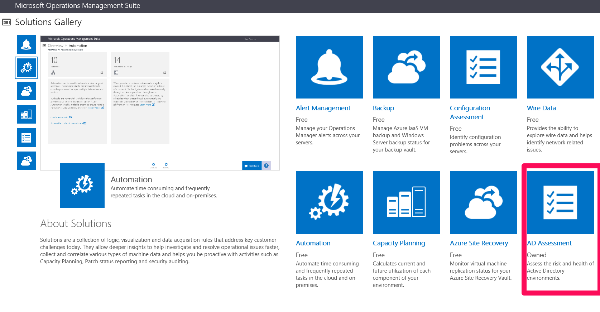

26.	The Operational Insights service will take several hours to gather log data and construct solution reports.  Check back with the tiles to keep track of progress.  
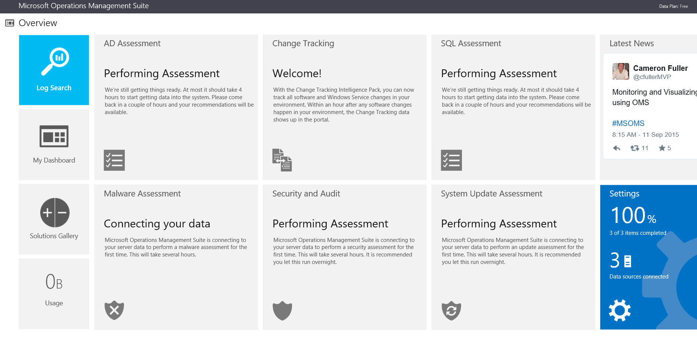

Stop here.  This is where the demo steps will continue from.

##  Demo Steps
*Estimated time: 10 minutes*

1.	Starting from the Azure Portal, select “Browse” from the left hand nav and then “Operational Insights Workspaces”
2.	Click on the pre-configured workspace to launch the classic portal
3.	Under the heading “Get Started” click “Visit your Operational Insights account”
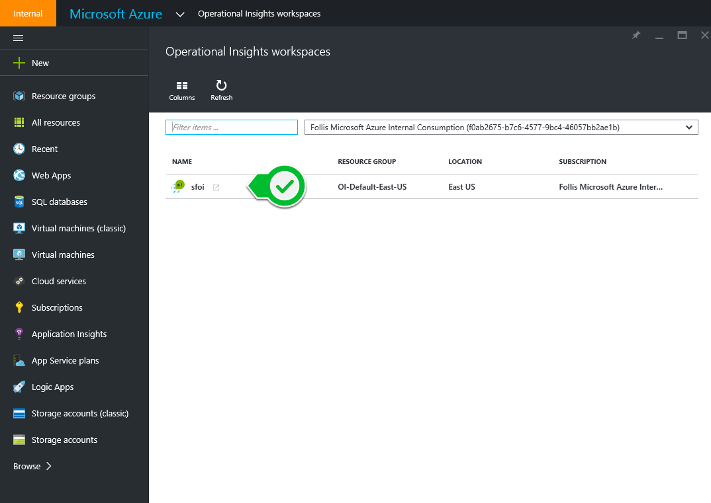

4.	On the Microsoft Operations Manager Suite home screen, talk through each of the live tiles, mentioning what they do and the information they are showcasing
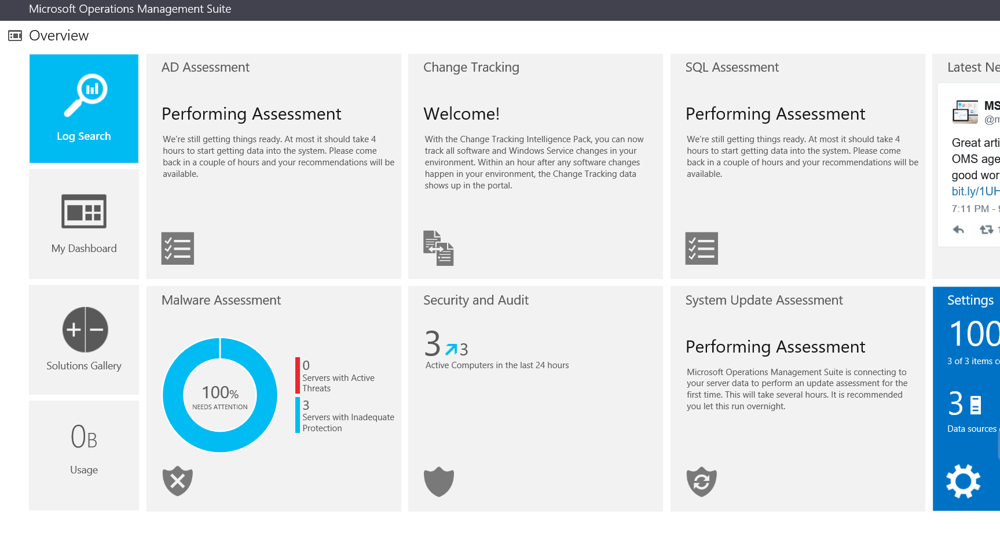

5.	Click on the Settings tile, then select “Connected Sources” from the top nav
6.	Point out that the VMs from our SPFarm are connected and sending log data into the service, that Linux and AWS connections are coming soon, that the service integrates nicely with SCOM, and agents are downloadable for manual installations 
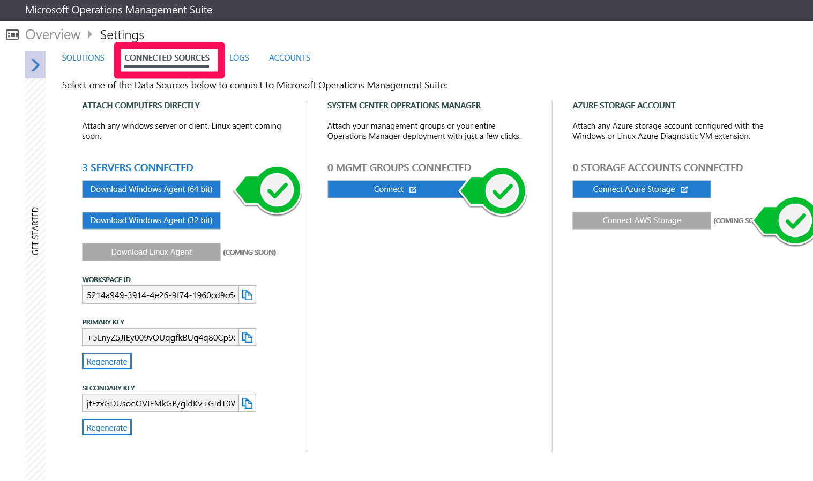

7.	Click “Logs” on the top nav 
8.	Point out the IIS Logs toggle, and that a variety of different event logs and performance counters can be configured depending on individual need
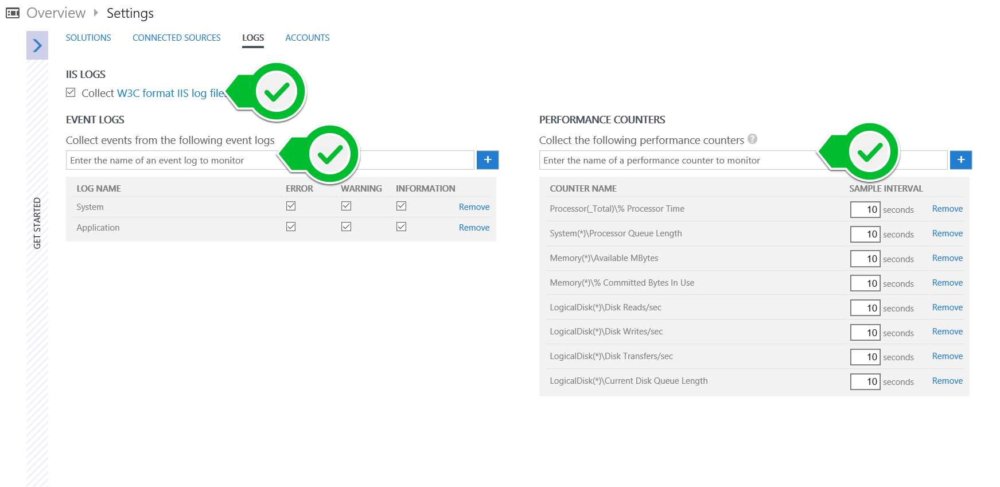

9.	Click “Accounts” on the top nav
10.	Point out the ability to secure the service to particular users and adjust data plan 
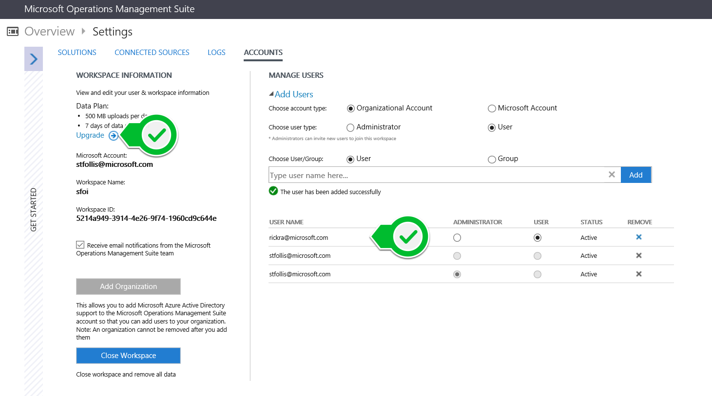

11.	Navigate back to the dashboard and select “Log Search”
12.	Point out the search bar, and select a canned search from the bottom section – “Missing Critical System Updates”
13.	In the search results page, comment on how the search syntax is similar to PowerShell
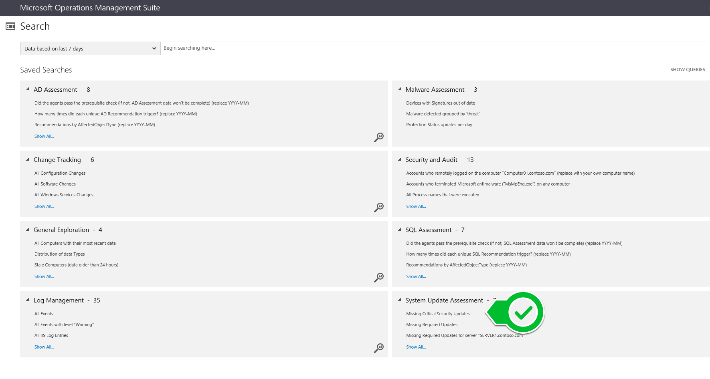

14.	Navigate back to the dashboard and select “Solutions Gallery”
15.	Talk through the solutions, how new ones are coming online soon, and that 3rd parties will be able to offer solutions 
16.	Back on the dashboard, select SQL Assessment and point out the data visualizations
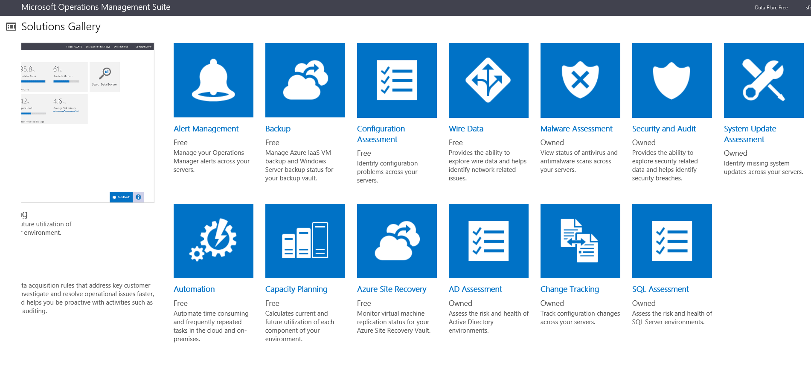

17.	Navigate back to the dashboard and select “My Dashboard”
18.	Click the “Customize” button on the bottom nav
19.	Drag three options onto the main pain to show how searches are added, for example “Missing Critical Security Updates”, “Protection Status Updates per Day”, and “All Configuration Changes” 
20.	Click on a tile to change their display type to an integer instead of a chart, and add a threshold
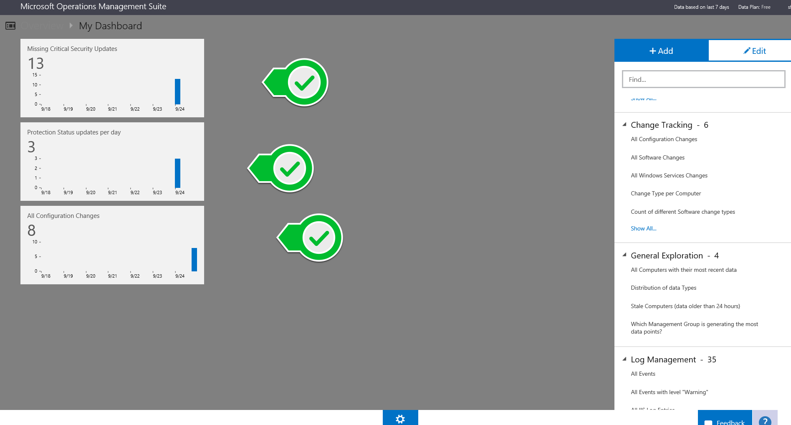

21.	Navigate back to the dashboard and summarize the different sections of the service

##  Clean Up
To clean up after this demo simply delete the resource group containing the sample SharePoint Farm, and delete the Operational Insights instance.