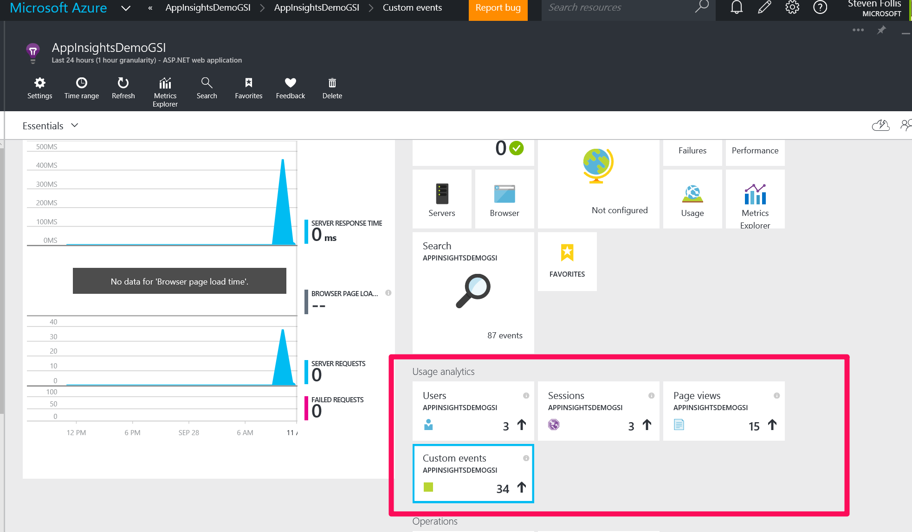

# Monitoring with Application Insights

This guide provides setup requirements and steps to demonstrate how to use the Azure Application Insights service for monitoring and diagnostics scenarios.  The demo is a lap around the different area of the service, giving audience members deeper familiarity with the features and functionality of App Insights.  The application is an ASP.NET web application with an AngularJS front end hooked into the backend and frontend sides of App Insights.

## Contents
* [Pre-Requisites](#pre)	
* [Setup](#setup)	
* [Demo Steps](#demosteps)	
* [Clean Up](#cleanup)	

##  Pre-Requisites
* An Azure subscription	
* Visual Studio 2015 Enterprise
* Demo solution code

##  Setup 
*Estimated time: 15 minutes*

1.	From the Azure Portal, create a new Application Insights resource and note the instrumentation key. A guide is available here: http://kenhaines.net/getting-an-application-insights-instrumentation-key/

2.	Open up a plain instance of Visual Studio 2015

3.	Open the demo code solution in a second Visual Studio 2015 instance
4.	Using the instrumentation key from Step #1, replace the instrumentation codes in ApplicationInsights.config, and Content/portfolio/app/app.js
5.	Either debug the application locally, or feel free to deploy to an Azure Web App. Then click on several top navigation options, and project tiles to generate sample data. 

Setup Completed.

##  Demo Steps
*Estimated time: 10 minutes*

1.	In the browser, navigate to the running demo portfolio application
2.	Discuss how this is a real world application that’s been Contosoi-ized, but is in production today.  Scroll down the page to show each section, click top navigation links, and interaction with a project in the Work section

3.	Navigate to a new tab showing the Azure Application Insights resource and maximize the blade
4.	Discuss the server side components of Server Response Time, Server Requests, and Failed requests
5.	Click Metrics Explorer and show setting up a graph for Server Requests and Failed Requests

6.	Back on the App Insights blade, discuss the “Usage Analytics” section
7.	Point out that this section is powered by JavaScript and helps understand the user – demographics, browser, and how they journey through the site’s pages

8.	Click “Users” and show users by Country/Region

9.	Click “Sessions” and show operating system and page views

10.	Click “Page views” and show activity by page name (similar because of the demo being a single page application) and entry/exit pages (where are users coming from and were do they go next?)

11.	Click “Custom Events” and discuss how the developer has the power to create metrics around any type of user behavior. In the demo application we have added a custom event for each click of a top navigation item, and on each project tile.  We can quantitatively gauge user interest with these custom events, better informing decision making for swapping out projects over time.
12.	Transition to Visual Studio’s support of App Insights

13.	In the fresh Visual Studio window, select File -> New Project
14.	Select “Web” from the available templates, then “ASP.NET Web Application”
15.	Discuss how Microsoft is baking support for AppInsights directly into the IDE, making it very easy to get going with a new project. Visual Studio will provision the instance for you, and if you create a new Azure Web App then you automatically receive an App Insights resource.
16.	Cancel out of the new Visual Studio window and open the demo solution window

17.	Discuss that the demo application was created with the same File -> New Project method as shown. Show the ApplicationInsights.config file that Visual Studio setup, working in conjunction with Nuget packages
18.	Right click on the Project to show that App Insights has its own menu options, and that if this was an existing web application we could add in support for App Insights right here

19.	Open Content -> portfolio -> app -> app.js and discuss how App Insights plugged right into our Angular application with a simple module, configured with the same instrumentation key

20.	Summarize that App Insights works across all types of web applications on a variety of platforms, and has great integration with the familiar Visual Studio workflow

Demo completed.

##  Clean Up
To clean up after this demo, delete the Resource Group containing any Azure Web Apps and any Azure Application Insights resources that were created.